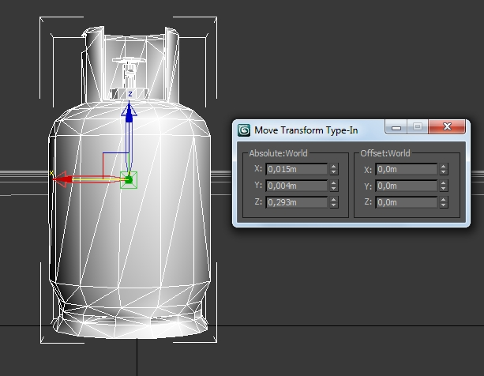
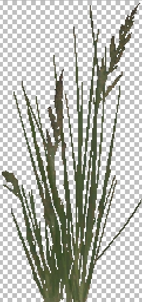
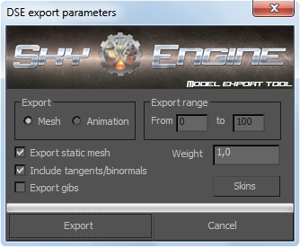
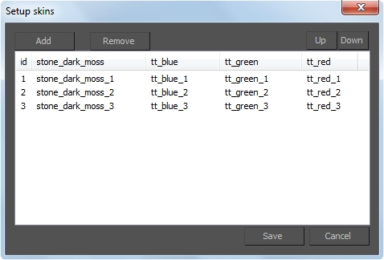

---
---

# Создание моделей и текстур

:::caution Not (yet) implemented feature

Некоторые функции, описанные в настоящем документе, более не поддерживаются, либо начнут поддерживаться в будущем.

:::

## Общие правила моделей

SkyXEngine рассчитан только на low-poly (низкополигональные) модели. Примеры игр с low-poly моделями (на которые была ориентация во время разработки):
* Half life 1, 2;
* F.E.A.R 1, 2;
* S.T.A.L.K.E.R.

Необходимо понимать, что один и тот же полигон, может быть отрисован несколько раз за один кадр. например взять открытый уровень с глобальным источником света, который имеет 4 сплита теней, в таком случае, как минимум вся видимая наблюдателю часть уровня будет отрисована дважды, а некоторые полигоны 3 и 4 раза, так как для наблюдателя сцена рисуется в отдельно проходе и для сплитов теней глобального источника света тоже в отдельных проходах. Если видимая часть сцены составляла 100 000 полигонов, то вместе с тенями от глобального источника света будет примерно 250 000 - 300 000 полигонов за кадр, а таких кадров должно быть как минимум 24 в секунду. Однако, рисуется не только то, что "видно наблюдателю", но даже те фрагменты сцены, которые не видны, в виду погрешности грубого отсечения для экономии ресурсов CPU, что в итоге составит примерно 400 000 отрисованных полигонов за кадр.

**Чем больше источников света отбрасывающих тени, тем большее количество раз будут рисоваться полигоны входящие в область действия этого света.**

Обобщенное правило регулирования количества полигонов основывается на значимости модели в игровом мире. Когда речь идет о наполняемости сцены, и не стоит вопрос о детализации, то логичнее использовать большие низкодетализированные модели нежели мелкие детализированные. Например: лампа в 1000 полигонов и дверь в 2000 полигонов имеют меньшую значимость на уровне нежели здание в 500 полигонов, значит лампа и дверь не должны выходить за рамки более значимого объекта. 

Однако, руководствоваться этим правилом необходимо опираясь на конкретную ситуацию. 

**Единицы измерения** - метр. 

** Координатная система** - left handed. 

То есть, позиция float3(1.0, 1.0, 1.0) это точка справа вверху спереди перемещенная на один метр в каждом направлении. 

Центр модели, должен быть в центре системы координат, но нижняя его точка должна быть на нулевом уровне. Это необходимо чтобы модели "не проваливались" в других моделях при их расстановке (если они провалятся их конечно можно поднять, но зачем делать лишнюю работу?). 

|  |
|-|
| На скриншоте видно что центр низа модели находится в центре координат |

Для детализации лучше использовать материалы (детальные текстуры, микрорельеф, parallax maping). 

## Общие правила текстур

Каждый полигон модели должен быть затекстурирован, нетекстурированные полигоны не допустимы. Настройка материалов осуществлется непосредственно [редакторе материалов SkyXEngine](mtl-editor.md).

При текстурировании следует использовать текстуры в более низком разрешении, так как возможна детализация материалов в редакторе материалов. Стоит помнить что чем больше текстура по размерам, тем больше она занимает памяти в постоянном хранилище, в оперативной памяти и требует большего времени при использовании ее в рендере.

Развертки не должны делаться для целей наложения декалей, для этого есть возможность в редакторе уровней (в разработке).

При текстурировании и создании текстур необходимо руководствоваться правилами [организации текстур](textures.md).

При текстурировании и создании текстур необходимо максимально использовать содержимое текстур, не допустимо использование лишь часть текстуры, только если другие модели не используют другие части этой же текстуры.

## Растительность

Модели и текстуры растительности подчиняются общим правилам, однако имеются так же свои нюансы.

Листва, трава, кусты должны:
* иметь полигоны с двух сторон, рендер задних граней движком не осуществляется, такие полигоны должны иметь противоположные нормали;
* в текстурах содержать пиксели для отброса (прозрачные), alpha значение которых должно быть менее 70% (шейдер gdefines.h GREEN_ALPHATEST_VALUE).

|  |
|-|
| Увеличенная текстура травы содержит прозрачные пиксели для отброса, с целью формирования изображения стеблей |

## Экспорт моделей из 3ds max

Для экспорта из моделей и анимаций в формат, понятный движку, создан специальный плагин. В данный момент поддерживается 3ds max версий 2010 (x32 и x64), 2016 (x64), 2017 (x64), 2018 (x64).

:::caution TODO

Добавить ссылки на скачивание

:::

### Установка

После скачивания, необходимо плагин соответствующей версии 3ds max переместить в директорию с установленным редактором 3ds max в поддиректорию plugins. Версию 3ds max, для которой был скомпилирован плагин можно найти в имени плагина, например DS3DSMAXexporter**2016**X64V706.dle.

Например: если 3ds max установлен в `C:/Program Files/Autodesk/3ds Max 2010` то плагин необходимо переместить в `C:/Program Files/Autodesk/3ds Max 2010/plugins`.

Для 3ds Max 2010 существует 2 версии: 32 и 64 бит. Каждая из версий устанавливается в отдельные директории, это значит что плагины нужно устанавливать для каждой версии, для 32 - DS3DSMAXexporter2010X32V706.dle, для 64 - DS3DSMAXexporter2010X64V706.dle 

### Использование

В 3ds max открываем главное меню, которое находится слева вверху, нажимаем Export. В строке file name вводим имя файла и сохраняем в формате DSE Model exporter (*.DSE). 

### Метрика

Метрика моделей должна быть в метрах. Для установки необходимо в Units setup в разделе System units setup выбрать Meters, раздел Display Unit Scale может иметь другую метрику.

Если модель уже не в метрах, то необходимо перейти во вкладку Utilities, нажать кнопку More.../Add... и выбрать Rescale World Units, далее действовать в соответствии с установленной метрикой, например миллиметры переводить в метры (устанавливая коэффициент 0.001), либо иные единицы измерения приводить к метрам. 

### Интерфейс плагина

|  |
|-|
| Основное окно экспортера |

Экспортер предоставляет возможность экспорта модели или анимации. Модель и каждая анимация должны быть экспортированы в отдельный файл, после чего можно их собрать с помощью редактора анимационных моделей

### Настройки экспорта моделей

1. **Статическая модель (Export static mesh)**. В этом режиме не производится экспорт костей, такую модель невозможно анимировать.
2. **Включить тангенты/бинормали (Include tangents/binormals)**. Режим включает экспорт таких атрибутов вершины, как тангенты и бинормали. Начиная с версии 0.10.0 движка, этот режим используется по умолчанию.
3. **Экспортировать обломки (Export gibs)**. В этом режиме, каждый объект модели экспортируется в отдельный файл с постфиксом в названии _gibNNN, где NNN - порядковый номер куска (с добавлением лидирующих нулей). Используется чтобы экспортировать куски разбиваемых объектов.
4. **Масса модели (Weight)**. Позволяет задать массу модели, для использования физикой движка.
5. **Кнопка настройки скинов (Skins)**. Запускает режим настройки скинов модели (см. ниже [Интерфейс настройки скинов](#интерфейс-настройки-скинов)).

### Настройки экспорта анимаций

1. Начальный кадр (Export range/From). С этого кадра будет начат экспорт анимации.
2. Конечный кадр (Export range/to). Последний кадр, который будет экспортирован.

## Интерфейс настройки скинов

Внешний вид окна настройки скинов представлен ниже:

|  |
|-|
| Окно настройки скинов |

В заголовках таблицы перечислены текстуры, использующиеся в модели. Каждая строка таблицы представляет собой отдельный скин. В ячейках таблицы указано, какая текстура будет использоваться вместо базовой, при активации этого скина. Если ячейка пустая - будет использована базовая текстура, указанная в заголовке столбца. Для редактирования нужно дважды кликнуть по нужной ячейке, при этом откроется окно, в которое необходимо вписать название текстуры без расширения, или оставить его пустым.

Настройки скинов сохраняются так же для текущей сцены в 3ds max, так что при последующем экспорте этой же модели, повторные настройки скинов производить не потребуется. 

## Экспорт физической модели

Для того, чтобы в экспортированной модели была встроенная физическая оболочка, нужно поместить ее модель в слой сцены с названием #physbox. Положение модели и ее физической оболочки в пространстве должны совпадать. Наложение текстур на части физической оболочки не является необходимым, так как даже при наличии - такие текстуры просто игнорируются, и не являются зависимостями модели. 

:::caution TODO

Вставить скриншот из макса

:::

Некоторые геометрические фигуры оптимизируются движком, это:
* Параллелепипед;
* Шар.

Остальные фигуры преобразуются в выпуклую оболочку, оптимизации не происходит.

Физическая оболочка из моделей используется в игровых объектах, начиная с версии 0.10.0.

Если модель не имеет встроенной физической оболочки, она генерируется из геометрии модели во время загрузки в движке.

## Экспорт лодов

Содержимое каждого слоя с названием `#lodN`, где N >= 1, экспортируется в отдельный лод модели с соответствующим номером. Лоды нумеруются начиная с 1. Положение модели и ее лодов в пространстве должны совпадать, при этом все лоды должны находится в той же сцене, что и основная модель, и физическая оболочка.

:::caution TODO

Вставить скриншот из макса

:::
