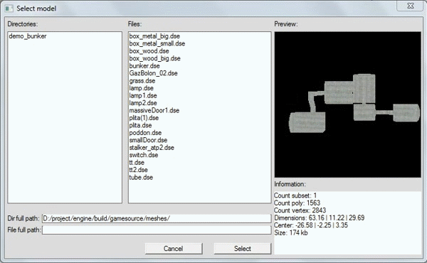
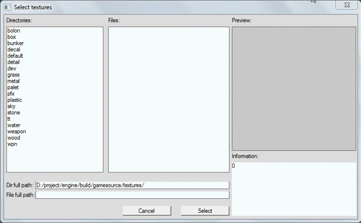
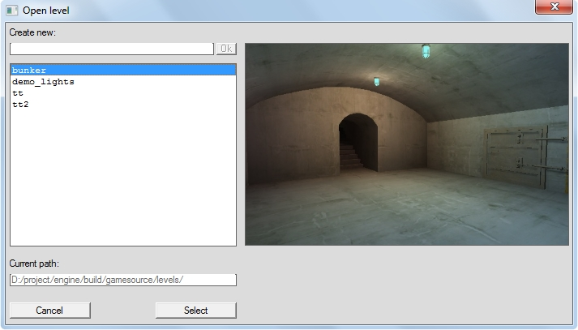
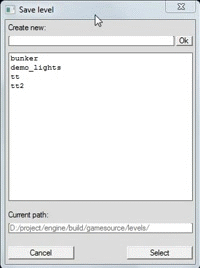

---
---

# Диалог выбора

:::caution Not (yet) implemented feature

Некоторые функции, описанные в настоящем документе, более не поддерживаются, либо начнут поддерживаться в будущем.

:::

Диалог выбора построен на схемах:
* **Выбора директории** - состоит только из одной колонки директорий;
* **Выбора файлов** - состоит из колонки директории и колонки файлов в этой директории.

Диалог выбора используется для:
* **Загрузки/сохранения уровня** (выбор директории);
* **Загрузки моделей/шейдеров/текстур** (выбор файла).

Диалог выбора файлов в редакторе уровней/материалов/партиклов не предусматривает возможность создания файлов. 

## Диалог выбора файлов

Диалог выбора файлов текстур/моделей имеет возможность просмотра превью текстуры/модели, которое генерируется генератором превью. Так же есть возможность просмотра информации о файле.

Выбор директории может быть осуществлен:
* двойным ЛКМ
* ЛКМ по кнопке Select

|  |
|-|
| Выбор файла (модели) и просмотр информации |

|  |
|-|
| Выбор файла (текстуры) и просмотр информации |

## Диалог выбора директории

Диалог выбора уровня имеет возможность просмотра превью уровня, которое создается самостоятельно дизайнером уровня в формате bmp (обязательно, так как используются штатные средства WinApi) и должно быть размером 400х250 пикселей. 

|  |
|-|
| Выбор директории (уровня) с возможностью просмотра превью |

Выбор директории может быть осуществлен:
* Двойным ЛКМ;
* ЛКМ по кнопке Select.

В контексте редактора уровней, каждый уровень должен быть сохранен в отдельную директорию, поэтому для того чтобы сохранить уровень, необходимо выбрать (или сначала создать) директорию сохранения. 

|  |
|-|
| Создание директории (уровня) в файле выбора директории |
