---
---

# Редактор уровней

:::caution Not (yet) implemented feature

Некоторые функции, описанные в настоящем документе, более не поддерживаются, либо начнут поддерживаться в будущем.

:::

## Общее описание

**LevelEditor** – редактор уровней движка SkyXEngine. Редактор работает с файлом в текстовом формате [.lvl](level-struct.md#конфигурационный-файл-уровня) 
который содержит информацию об уровне, дополнительная информация может загружаться из внешних файлов. Данный файл должен находится по относительному пути 
`/gamesource/level/name_level/name_level.lvl` при этом имя директории и имя файла `.lvl` должны быть идентичными.

Редактор уровней имеет [диалог выбора файлов/директорий](dialog-select.md). 

| 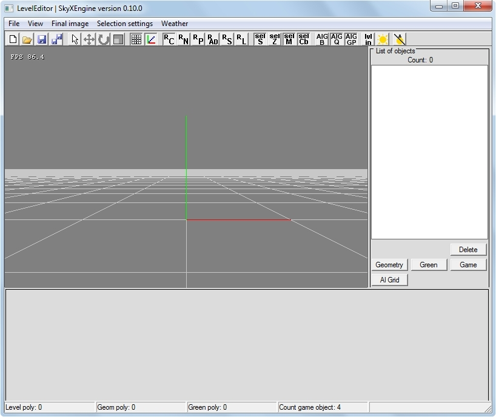 |
|-|
| Окно редактора уровней |

Редактор уровней может работать с объектами уровней:
- Загружать статические модели и расставлять их как [статическую геометрию](world-objects.md#статическая-геометрия) (основу уровня), применяя к ним возможные трансформации (перемещение, повороты, масштабирование);
- Создавать/редактировать/удалять [растительность](world-objects.md#растительность), используя при этом статические модели, возможна генерация по маске и/или ручная расстановка (создание/перемещение)/удаление;
- Создавать/редактировать/удалять [игровые объекты](world-objects.md#игровые-объекты), загружая в них статические или анимационные модели если позволяет класс объекта;
- Создавать/редактировать/удалять связи между игровыми объектами, образуя тем самым логику и интерактивность уровня;
- Создавать/редактировать/удалять AI сетку, по которой осуществляют перемещение живые игровые объекты.

Так же редактор уровней позволяет просматривать итоговое изображение в различных режимах. Например, для проверки правильности настройки групп сглаживания в 3d редакторе, в редакторе уровней можно включить режим "отрисовки нормалей". 

| 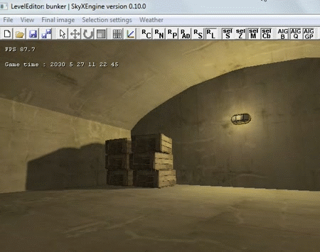 |
|-|
| Смена режимов итогового изображения |

Редактор позволяет выделять и подсвечивать выбранные объекты:
- Объекты статической геометрии - подсветка рисуется по модели;
- Растительность - подсветка всего вида (например "деревья тополь") вместе с его объектами по объектно, выделение объекта растительности (например конкретного "дерева") происходит по модели объекта;
- Игровые объекты - подсветка рисуется по кубу;
- AI сетка - подсветка рисуется по квадратам.

Подсветка объектов имеет несколько режимов:
- Использование Z-test;
- Заливка модели;
- Отсечение задних граней.

| 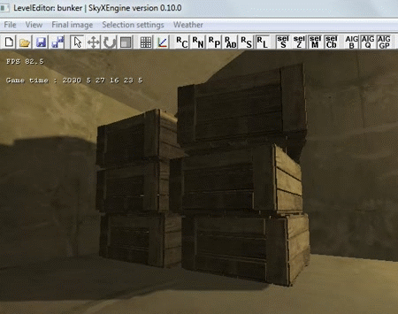 |
|-|
| Режимы выделения объектов |

## Структура окна

Окно состоит из структурных элементов (сверху вниз):

- Заголовок окна, содержащий имя редактора и имя уровня;
- Меню;
- Панель инструментов, где расположены основные управляющие кнопки;
- Содержимое окна:
	- Окно рендера;
	- Список объектов с вкладками;
	- Раздел настроек выделенного объекта;
- Строка состояния.

### Меню

Меню программы состоит из следующих элементов:

- **File**:
	- New – очистить сцену и создать новый уровень;
	- Open – открыть файл уровня;
	- Save – сохранить уровень;
	- Save as ... – сохранить уровень как;
	- Exit – выход из программы;
- **View** (редакторные настройки вида):
	- Grid – сетка разметки (оси xz);
	- Axes – линии по направлению осей;
- **Final image** (выводимое изображение в окно рендера):
	- Color – цвет;
	- Normals – нормали;
	- Parameters – параметры освещения;
	- Ambient - фоновое и диффузное освещение;
	- Specular – отраженный свет;
	- Lighting scene – освещенная сцена;
- **Selection settings** (настройки выделения):
	- Selection - надо ли выделять объект;
	- Z Test - использовать ли z test при рендере выделения;
	- Mesh - показывать сетку или модель целиком при выделении;
	- Cull backfaces - показывать задние грани выделения;
- **Weather** (погода), выбор погоды для просмотра уровня в условиях погоды. Выбор погоды сделан только для демонстрации и не сохраняется в файл уровня:
	- none - без погоды;
	- Список доступных конфигов погоды.

Некоторые элементы меню повторяют функционал элементов панели инструментов. 

### Панель инструментов

| 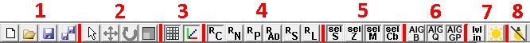 |
|-|
| Панель инструментов |

Панель инструментов состоит из нескольких областей:

1. Очистка/загрузка/сохранение:
	- Очистка уровня - удаление всех данных об уровне;
	- Загрузка - загрузить уровень из файла;
	- Сохранить - сохранить уровень в файл, если уровень был открыт из файла, то при нажатии не будет диалога выбора директории - сохранение произойдет в ту же директорию;
	- Сохранить как - сохранить уровень в файл в обязательным вызовом диалога выбора директории;
2. Режим выбора/трансформации:
	- Выбор объектов выбранной группы;
	- Перемещение объекта;
	- Поворот объекта;
	- Масштабирование объекта (работает только для статической геометрии);
3. Рендер вспомогательных редакторных элементов:
	- Рендер сетки в центре координат на плоскости XZ;
	- Рендер направления осей в центре координат;
4. Итоговое изображение - вывод в окно рендера итогового изображения:
	- Цвета текстур (albedo);
	- Нормали (включая карты нормалей);
	- Параметры освещения;
	- Текстура с ambient и diffuse составляющей (заметен только ambient);
	- Текстура с specular (блик/блеск);
	- Освещенная сцена;
5. Режим выделения объектов:
	- Рисовать ли выделение;
	- Использовать Z-test;
	- Использовать выделение граней;
	- Использовать отсечение задних граней;
6. Режим выделения AI сетки:
	- Рисовать ограничивающий объем всей AI сетки;
	- Рисовать квадраты AI сетки;
	- Рисовать graph points;
7. Настройка типа уровня:
	- in - уровень закрытый, out - уровень открытый (значит будет небо, глобальный источник света и прочие открытые элементы);
	- Включить/выключить глобальный источник света;
8. Обнуление данных локальных источников света, сделано для случаев когда в сцене имеются локальные источники света со статическими тенями, которые надо обнулить после расстановки объектов по сцене чтобы увидеть тени.

### Список объектов с вкладками

| 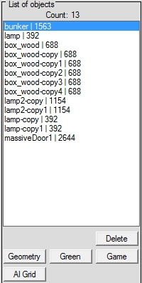 |
|-|
| Список объектов с вкладками |

Данный список содержит все элементы выбранной группы. При клике по элементу списка, будет выделен соответствующий объект в сцене и раздел содержимого настроек примет настройки объекта для манипуляции ими. 

Вкладки представлены кнопками:
- Geometry - [статическая геометрия](world-objects.md#статическая-геометрия);
- Green - [растительность](world-objects.md#растительность);
- Game - [игровые объекты](world-objects.md#игровые-объекты);
- AI Grid - AI сетка.

При клике по вкладке, будут выведены все объекты выбранной подгруппы, выделение объекта будет сброшено, раздел содержимого настроек примет статус создания нового элемента.

Кнопка _Delete_ удаляет выбранный объект. 

### Раздел настроек выделенного объекта

Данный раздел находится внизу окна, под окном рендера и списком объектов. Интерфейс данного раздела зависит от группы выбранного объекта. 

#### Статическая геометрия

| 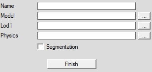 |
|-|
| Интерфейс создания объекта статической геометрии |

Интерфейс создания объекта статической геометрии содержит следующие элементы:
- **Name** - имя объекта, произвольная форма, сделана для удобства распределения моделей для пользователя;
- **Model** - путь до статической модели (относительно директории со статическими моделями);
- **Lod1** - путь до лода статической модели (относительно директории со статическими моделями);
- **Physics** - путь до физической модели (относительно директории со статическими моделями);
- **Segmentation** - функция деления модели, надо использовать в случае если модель является большой по объему и количеству полигонов, эта опция активна только на момент создания объекта, после этого этапа отменить деление либо установить его невозможно.

**Для создания объекта статической геометрии**, необходимо лишь указать путь до модели, при помощи ручной записи либо при помощи диалога. Затем:
- Нажать кнопку Finish, объект будет создан в центре координат;
- В окне рендера нажать СКМ (подробнее [Дополнительные способы создания объектов](#дополнительные-способы-создания-объектов)).

После создания объекта, он будет автоматически выделен и его свойства будут доступны для редактирования.

Остальные элементы являются опциональными, однако, хорошим тоном дизайна уровней является:
- Осознанная установка имен объектов;
- Использование лодов и физических моделей для высокополигональных объектов;
- Сегментация объемных (по габаритам и полигонам) моделей.

| 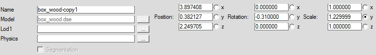 |
|-|
| Интерфейс редактирования объекта статической геометрии |

Интерфейс редактирования объекта статической геометрии, помимо перечисленного, содержит следующие элементы:
- **Position** - позиция;
- **Rotation** - вращение (в радианах);
- **Scale** - масштабирование.

Позицию объекта можно задавать написанием точных координат, либо установкой переключателя на одну из осей и `RShift + ЛКМ` и движение мыши. 

#### Растительность 

В отладке

#### Игровые объекты

| 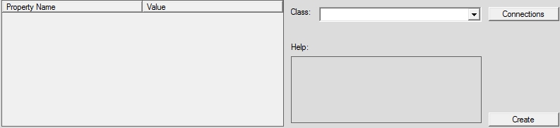 |
|-|
| Интерфейс игрового объекта (пустой - готовый к созданию) |

Интерфейс свойств игрового объекта состоит из следующих элементов:
- **Таблица свойств**, столбец Property Name содержит названия свойств, столбец Value - значения;
- **Class** - класс объекта;
- **Help** - подсказка;
- **Create** - создание нового объекта, есть только на этапе создания игрового объекта;
- **Connections** - переход к соединениям объекта.

Для создания игрового объекта необходимо выбрать класс, после этого:
- Нажать кнопку Create, объект будет создан в центре координат;
- В окне рендера нажать СКМ (подробнее [Дополнительные способы создания объектов](#дополнительные-способы-создания-объектов)).

После создания игрового объекта, он будет автоматически выделен и таблица свойств будет заполнена его доступными свойствами.

Каждый класс игровых объектов содержит свои доступные свойства и данные для создания соединений. 

| 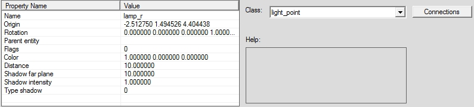 |
|-|
| Пример интерфейса свойств игрового объекта "точечный свет" |

| 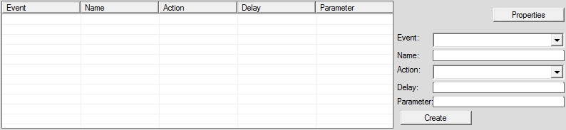 |
|-|
| Интерфейс соединений игровых объектов |

Интерфейс соединений игровых объектов состоит из:
- **Таблица соединений** игрового объекта;
- **Event** - событие (выход);
- **Name** - имя игрового объекта, с которым происходит связь;
- **Action** - действие (вход);
- **Delay** - задержка в секундах (float);
- **Parameter** - дополнительный параметр;
- **Create** - создание нового соединения;
- **Properties** - переход к свойствам объекта.

#### AI сетка

Интерфейс создания AI сетки условно поделена на 2 части:
- Создание границ;
- Создание ячеек сетки.

| 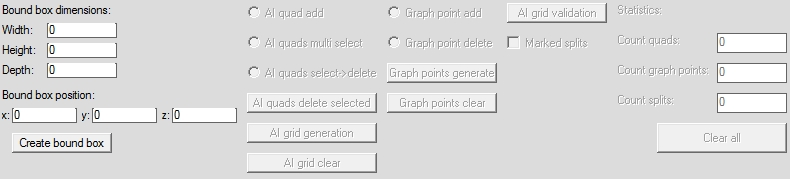 |
|-|
| Интерфейс создания границ бокса для создания AI сетки |

Интерфейс создания границ бокса состоит из:
- **Bound box dimensions** - габариты бокса;
- **Bound box position** - позиция/центр бокса;
- **Create bound box** - кнопка создания бокса по указанным габаритам.

После создания ограничивающего бокса, разблокируется другая часть интерфейса для создания ячеек, но заблокируется часть создания бокса. 
Для того чтобы изменить бокс, необходимо полностью очистить все данные AI сетки нажав кнопку _Clear all_. 

| 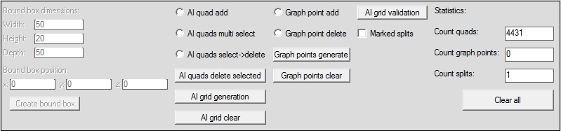 |
|-|
| Интерфейс создания ячеек AI сетки |

После создания границ доступны следующие возможности:
- **AI quad add** - добавить квадрат по ЛКМ;
- **AI quad multi select** - мультивыделение квадратов по ЛКМ, и единичное выделение по ПКМ;
- **AI quads select->delete** - удаление при выделении ЛКМ;
- **AI quads delete selected** - удалить выделенные;
- **AI grid generation** - сгенерировать сетку;
- **AI grid clear** - очистка сетки (удаление всех квадратов);
- **Graph point add** - добавить графпоинт по ЛКМ;
- **Graph point delete** - удалить графпоинт по ЛКМ;
- **Graph points generate** - сгенерировать графпоинты;
- **Graph points clear** - очистить список графпоинтов;
- **AI grid validation** - проверить сетку на валидность;
- **Marked splits** - отмитить куски сетки разными цветами.

Если есть хотя бы один выделенный квадрат, LCTRL + ЛКМ (вверх/вниз) будет перемещать квадрат/квадраты.

Также есть раздел статистики:
- Count quads - количество квадратов сетки;
- Count graph points - количество графпоинтов;
- Count splits - количество кусков сетки.

#### Генерация AI сетки

Для генерации AI сетки необходимо чтобы хотя бы один из квадратов был не замкнутый, 
то есть не имел препятствий или соседних квадратов хотя бы с одной стороны. 
Если это условие выполняется тогда можно генерировать сетку путем нажатия на кнопку _AI grid generation_.

### Строка состояния

| 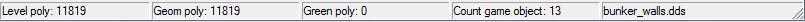 |
|-|
| Строка состояния |

Строка состояния показывает текущую статистику уровня:
- **Level poly** - общее количество полигонов на уровне;
- **Geom poly** - количество полигонов статической геометрии;
- **Green poly** - количество полигонов растительности;
- **Count game object** - количество игровых объектов;
- **Имя текстуры**, если был выделен объект путем трассировки луча.

## Управление

### Камера

- CTRL + w – движение вперед;
- CTRL + s – движение назад;
- CTRL + a – движение влево;
- CTRL + d – движение вправо;
- SHIFT - ускорение;
- CTRL + ПКМ – движение вверх/вниз;
- CTRL + ЛКМ – вращение.

### Дополнительные способы создания объектов

Кроме основных способов создания объектов, существует дополнительный/упрощенный: после настройки всех данных объекта, 
необходимо произвести СКМ в окне рендера, при этом все режимы выбора/трансформации должны быть отключены, 
объект будет создан в месте пересечения луча со статической геометрией. 

### Выделение объектов

Есть 2 способа выделить объект:
- Через выделение [строки списка объектов](#список-объектов-с-вкладками);
- Через ЛКМ в окне рендера (трассировка), для этого должен быть выбран Режим выбора (в [панели инструментов](#панель-инструментов), в разделе Режим выбора/трансформации) и одна из [вкладок списка объектов](#список-объектов-с-вкладками) должна быть активирована.

| 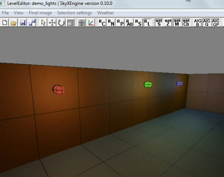 |
|-|
| Выделение объектов щелчком мыши |

### Хелпер трансформации

**Хелпер трансформаций** - объект редактора уровней, при помощи которого, возможна трансформация объектов в интуитивно понятном виде.

Хелпер трансформаций поддерживает следующие режимы:
- Перемещение;
- Повороты;
- Масштабирование.

Для использования хелпера трансформаций необходимо:
- Выбрать объект (из статической геометрии или растительности или игровых объектов);
- В [панели инструментов](#панель-инструментов), в разделе _Режим выбора/трансформации_ выбрать нужный вид трансформации;
- Управлять необходимо наведением на хелпер курсора мыши, после чего выделяться ось/оси/стрелки, зажать ЛКМ и перемещать мышь в нужном.

| 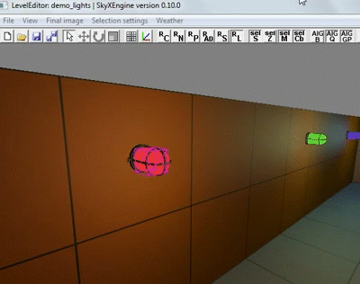 |  |  |
|-|-|-|
| Изменение позиции хелпером | Изменение поворотов хелпером | Изменение масштаба хелпером |

### Дополнительные способы трансформации объектов

Статическая геометрия, объекты растительности и игровые объекты, помимо указанных способов перемещения, 
могут быть перемещены при помощи СКМ в окне рендера (объект должен быть выбран), объект будет перемещен в точку столкновения луча со статической геометрией. 

### Копирование объектов

Копировать можно статическую геометрию и игровые объекты. Для этого необходимо выбрать исходный объект, далее нажать `CTRL + C`, после этого, 
за курсором мыши будет закреплен визуал выделения объекта, движение происходит по нижней плоскости объекта, ЛКМ - создать копию объекта в текущей позиции, 
ПКМ - отменить копирование, СКМ - трассировка луча по статической геометрии и установка в месте пересечения. 

| 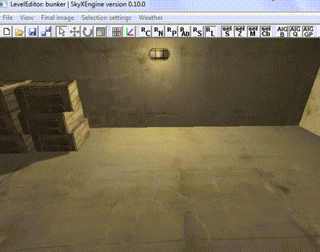 |
|-|
| Копирование модели и расстановка копий |
