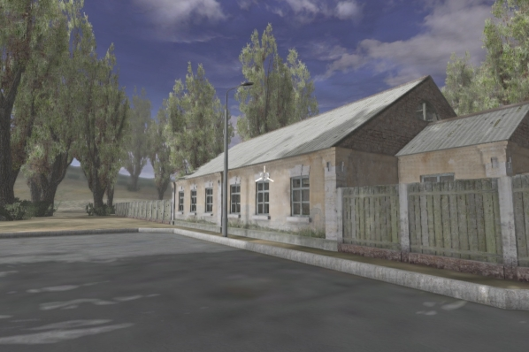
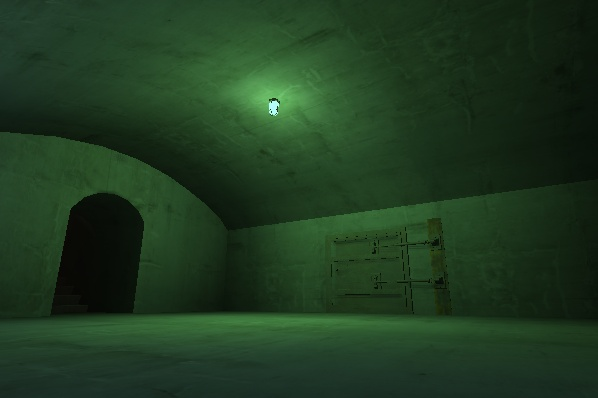
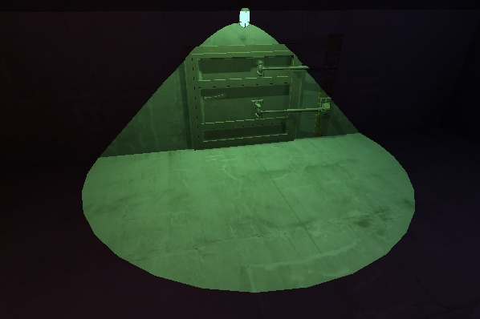
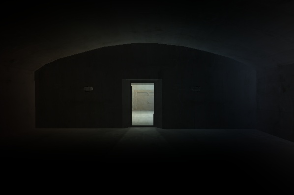
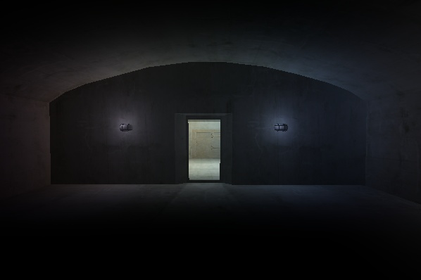
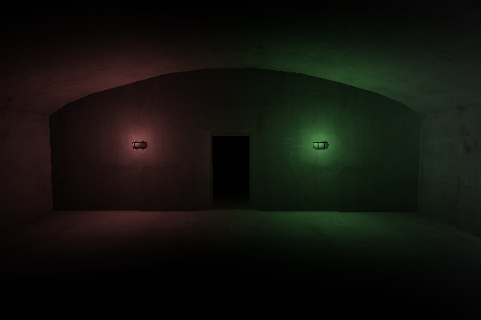
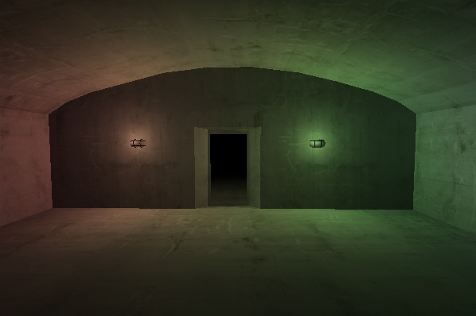
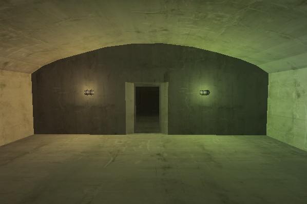
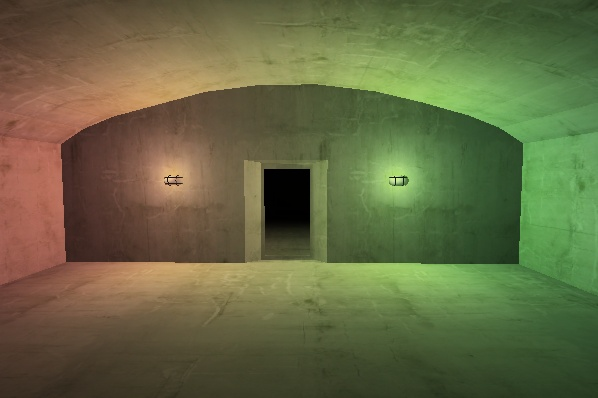

---
---

# Освещение

:::caution Not (yet) implemented feature

Некоторые функции, описанные в настоящем документе, более не поддерживаются, либо начнут поддерживаться в будущем.

:::

## Внутренняя реализация

Источники света, и все что к ним прямо относится реализовано в библиотеке sxlight.dll

Работа с локальными источниками света осуществляется игровой библиотекой sxgame.dll через игровые объекты Light point и Light directional, 
с глобальным посредством внутренних механизмов библиотеки sxlevel.dll при помощи настроек уровня и погоды.

Освещение рассчитывается в библиотеке рендера sxrender.dll

SkyXEngine реализует только динамическое (real-time) освещение. Не поддерживается рассеянное освещение и осуществляется только прямой расчет. 
Внутренние оптимизации по расчету теней присутствуют.

Движок использует [deferred shading](http://www.gamedev.ru/terms/DeferredShading) для расчетов освещения, это позволяет создавать неограниченное 
реализацией количество источников света. Единственное ограничение в данном случае это производительность. Все источники света, который генерируют тень, 
требуют бОльших вычислительных операций, нежели те источники света, которые не генерируют тень.

Освещение и материалы реализованы по принципам Physically based rendering (PBR), но без использования отражений. Это значит что для настройки 
материала нужно руководствоваться [основными понятиями и составом материалов](mtl-basics.md) и не заботиться об их внешнем виде в различных ситуациях. 

## Типы и виды источников света

Освещение состоит из глобального и локального источников света.

Виды источников света:
- Глобальный (солнце) - освещает всю локацию;
- Локальный точечный (лампочка) - освещает все в радиусе освещаемости;
- Локальный направленный (прожектор) - освещает все в направлении освещения по дистанции освещаемости.

|  |  |  |
|-|-|-|
| Освещение глобальным источником света | Освещение точечным источником света | Освещение направленным источником света |

:::info

Глобальный источник света на уровне может быть только один, движок не создаст второй, а просто вернет текущий.

:::

## Трансформации

Глобальный источник света всегда находится на фиксированном удалении от игрока 1000 метров (дефайн `LIGHTS_POS_G_MAX`), и имеет радиус действия 999999 метров (дефайн `LIGHTS_GLOBAL_STD_RADIUS`).

Глобальный источник света имеет относительную позицию в мире, которая измеряется градусами [0, 360] относительно горизонтали (ось Z) и вертикали (ось Y). 
То есть, позиция (10, 20) переместит (повернет) источник света на 10 градусов по оси Z, и на 20 градусов по оси Y. 

:::caution TODO

Добавить пример где будет показано смещение глобального источника света.

:::

:::caution

Глобальный источник света не должен находится в абсолютном зените (90, 90), так как в этом случае обнаружены ошибки построения теней, необходимо смещение хотя бы на 1 градус в любую сторону.

:::

Глобальный источник света не может быть повернут, то есть не принимает трансформации поворотов.

Все локальные источники света света принимают трансформации позиции и поворотов.

Повороты для точечных источников света бессмыслены, если они не имеют ограничивающих объемов, так как такой источник света светит во все стороны. 

## Тень от источников света

Каждый из источников может отбрасывать или не отбрасывать тень.

**Тени для глобального источника света рассчитываются по технологии Parallel-Split Shadow Map (PSSM)** и имеют 4 или 3 (опционально, чем больше тем дальше тень и меньше производительность) сплита.

**Интенсивность тени у глобального источника света** зависит от его силы, чем сильнее свет тем менее заметна тень, и наоборот.

**Тени для локальных источников света рассчитываются по технологии shadow map**. Стоит учесть, что точечные источники света занимают больше памяти и отнимают больше производительности, 
нежели направленные. Это связано с тем, что точечные источники света используют 6 карт глубин (по одному на каждое направление) чтобы создать эффект точечного освещения при отбрасывании теней. 
А направленный источник света использует всего одну карту глубины.

**Интенсивность тени локальных источников света** регулирует дизайнер уровней в редакторе уровней, основываясь на текущем освещении сцены. Если тени выглядят слишком резкими и неестественными, 
то путем правки Shadow Intesity можно ослабить тень, придав ей более приятный и реалистичный вид.

Тени для локальных источников света могут быть:
- Статичными - карта глубины рассчитывается только один раз (при создании или трансформации - смене позиции/поворота), и в дальнейшем не изменяется, 
что увеличивает производительность, но делает тени статичными, так как информация о загораживателях генерируется однажды;
- Динамичными - карта глубины перестраивается каждый раз при обновлении источника света, в этом случае все динамические объекты, каждый раз будут отбрасывать правильную тень;

На первый взгляд статические и динамические тени не отличимы, однако если игровой объект попадет в зону свечения статического источника света, то этот объект не будет отбрасывать тени.

### Особенности и ошибки отбрасывания тени

Вообще тень не имеет абсолютно черного цвета, это сделано для плавности переходов в освещении, что значительно улучшает итоговое изображения. Однако, это вносит некоторые ошибки в общее освещение. 
Другим источником ошибки, общего освещения, является не полная интенсивность тени для локального источника света.

Для их устранения необходимо использовать дополнительные источники света, которые имеют низкие характеристики освещения и по возможности не отбрасывают тени (либо статические). 

|  | 
|-|-
| Ошибка освещения - свет из дальних комнат проникает в ближние, не смотря на наличие теней | Размещение дополнительных источников света, со слабыми характеристиками, в местах проявления ошибок, минимизирует их заметность

## Цвет и сила света

Каждый источник света имеет цвет света, который представлен float компонентами RGB (r - красный, g - зеленый, b - синий) в пределах [0, 1]. Например:
- 1, 0, 0 - красный;
- 1, 1, 1 - белый;
- 0.5, 0.5, 0.5 - серый.

Сила света определяет значимость вклада данного света в итоговый цвет сцены - чем сильнее свет, тем больше его цвет будет участвовать в формировании сцены, и наоборот. 
Глобальный источник света, часто обладает большей силой нежели локальные. Каждый источник света имеет силу света, которая определяется максимальным значением компонент 
цвета (rgb, какая компонента больше, та и будет взята за основу силы света).

Для локальных источников максимальная компонента умножается на коэффициент максимальной силы источника света (дистанция свечения / 100 метров (максимальная дистанция 
свечения для локальных источников света 200 метров (дефайн `LIGHTS_LOCAL_MAX_DIST`))). 

## Ограничивающая модель

Каждый источник света имеет ограничивающий объем, который может быть представлен моделью (в разработке). То есть, в сцене освещается лишь то, что входит в ограничивающую модель.

:::caution TODO

Показать ограничивающий объем света.

:::

Например, если лампа висит на стене, то установив ей в качестве ограничивающей модели полусферу и отключив тени, можно избежать освещения всего того, что находится за стеной, где висит лампа.

Пользовательская модель должна быть статической моделью с любой текстурой, но текстура при этом никак не используется и даже не загружается.

Глобальный источник света генерирует ограничивающую модель, но она не используется для расчетов освещения. 

:::info

На данный момент (версия 0.10.0) используются только автогенерируемые модели (сфера для точечных и глобального источника света, конус для направленного), установка пользовательской модели в разработке.

:::

## Дальность освещения

Глобальный источник света всегда удален на константное фиксированное расстояние 1000 метров (дефайн `LIGHTS_POS_G_MAX`), а дистанция освещения 999999 метров (дефайн `LIGHTS_GLOBAL_STD_RADIUS`).

Локальные источники имеют дистанцию освещаемости:
- Точечный - радиус;
- Направленный - дальность.

Но обобщенно параметр дальности освещения у локальных источников света назван "дистанция" (Distance).

Суть параметра дистанции - охват территории освещения.

Дистанция освещения для локальных источников света играет роль в расчете силы света.

Дистанция освещения для локальных источников света не должна превышать 200 метров (дефайн `LIGHTS_LOCAL_MAX_DIST`).

Локальные источники света имеют параметр Shadow far plane, его суть заключается в регулировании дальней плоскости отсечения (или по-простому - дальности теней). 
Эта регулировка поможет избежать ошибок затенения. В ходе тестирования было выявлено, что если повесить точечный источник света на стену и выставить ему 10 метров 
дальность освещения и теней, то будет видно неправильно затенение, но если увеличить дальность теней, то ошибки исчезают. 

## Формирование итогового цвета освещения

Итоговое освещение считается в 2 прохода:
- Формирование промежуточных данных в накопительном режиме;
- Обработка накопленных данных.

Из-за накопительного режима возникают некоторые нюансы при обработки результатов, которые можно решить путем понимания сущности обработки освещения.

В первом этапе все данные записываются в один и тот же буфер смешиваясь с предыдущими результатами, из-за чего может возникать переполнение некоторых компонент, что приведет к не совсем корректному освещению.

**2 источника света (значение максимальной компоненты 1) на близком удалении друг от друга, с усилением силы света перекрывают друг друга смешиваясь в один цвет путем накопления данных.**

|  |  |  |
|-|-|-|
| Дистанция 10 метров | Дистанция 20 метров | Дистанция 30 метров |

Как видно на третьем скрине, источники света, практически перекрыли друг друга смешавшись в один цвет. В некоторых случаях это не является критичным, но для критичных случаев есть решение: 
сокращение дистанции с увеличением силы света (путем увеличения компонент света). То есть сохранение итоговой силы света с сокращенной дистанцией, что приведет к бОльшему влиянию света 
на ближайшие объекты, более интенсивному освещению, как если бы использовались более дальние источники света. 

