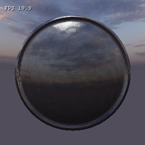

---
---

# Основные понятия и состав материалов

:::caution Not (yet) implemented feature

Некоторые функции, описанные в настоящем документе, более не поддерживаются, либо начнут поддерживаться в будущем.

:::

**Материал** - набор свойств (настройки и текстурные карты), которые формируют внешний вид объекта. Материал также содержит физические свойства. 

|  |
|-|
| Вид демонстрационного материала в редакторе материалов |

## Устройство материалов

Система материалов основывается на принципе **текстура <=> материал**, то есть каждый материал существует для какой-то одной определенной текстуры и каждая текстура имеет только один материал.

Это сделано для того чтобы унифицировать использование текстур на разных объектах. Например, текстура бетонной стены может использоваться на разных моделях, в разных условиях, на разных локациях, может быть освещена разными источниками света, но она всегда будет иметь одни и те же параметры материала (параметры освещения, шейдеры, физические характеристики и прочее), так как материал настроен для текстуры.

Пример: модель имеет текстуру `mtl_rja.dds`, используемый для этой текстуры материал будет иметь имя `mtl_rja.mtl`, материал устанавливает для этой текстуры в любой среде одни и те же параметры.

При помощи этого принципа, возможно общее сокращение текстур за счет того, что текстуры могут повторно использоваться и иметь (а возможно выглядеть одинаково) при этом одинаковые свойства. Например, если на текстуре должен быть bump mapping, то материал будет устанавливать его на всех текстурах, и эта текстура в любой среде будет его иметь, другое дело как среда будет воздействовать на него.

**На одну и ту же текстуру нельзя установить разные материалы. На разные модели с одной и той же текстурой нельзя установить разные материалы, потому что материал устанавливается на текстуру.**

Этот принцип работает в идеале до тех пор, пока пользователь специально не нарушит правило воспользовавшись специально сделанной лазейкой: можно одну и ту же текстуру установить в качестве _albedo_ для разных материалов. Это является нарушением правила, которое было сделано специально для возможности создания нестандартных материалов. Например, модель можно затекстурировать текстурой с именем `tex_tex.dds` которой на самом деле нет, но при настройке ее материала (физический файл обязательно должен существовать на этом этапе) можно назначить _albedo_ текстуру `tex_tex2.dds`, и так можно сделать с любым другим материалов и назначить любую другую текстуру в качестве _albedo_ текстуры. 

## Основные графические свойства

К основным графическим свойствам относятся:
* Основная и albedo текстуры;
* Шейдеры;
* Данные шейдеров;
* Освещаемость;
* Альфатест (alpha test);
* Тип материала модели.

### Основная и albedo текстуры

**Основная текстура** (albedo) - текстура (diffuse), которая накладывается еще в 3d редакторе. Каждый материал обязан иметь текстуру, так как каждый материал привязывается к текстуре. Таким образом, материал для текстуры является единичным и единственным.

**Albedo текстура** - это текстура поверхности объекта, которая освещена абсолютно белым, рассеянным светом. На такой текстуре не должно быть видно освещения. Иными словами, эта текстура содержит только цвета всех точек объекта и не более того. Такое ограничение логично и призвано не нарушать систему освещения.

Разница между _основной текстурой_ и _albedo_ заключается в том, что _albedo_ текстуру можно переопределить. По умолчанию в качестве _albedo_ текстуры используется основная текстура.

Однако, в отдельных случаях, для улучшения итогового изображения, текстуры могут содержать некоторые элементы освещения без цвета света, например fake occlusion (см. ниже [Текстура параметров освещения](#текстура-параметров-освещения)). 

### Шейдеры

**Шейдеры** - программы для обработки графических данных на GPU.

_Рекомендации к прочтению: [Стандартные шейдеры материалов](stdshaders.md)._

Каждый материал обязан иметь шейдер для рендера, так как именно шейдеры организуют обработку данных.

**Данные шейдеров**. Каждый шейдер принимает определенные данные. Набор данных, отправляемых в шейдер, зависит от прохода, и конкретного шейдера. 

## Свойства детализации

Объекты детализации:
* Детальные текстуры (_detail_) - это текстуры, которые при наложении на материал создают некое подобие детальности;
* Микрорельефные текстуры (_microrelief_) - это текстуры с нормалями, которые смешиваются с основными нормалями и создают тем самым дополнительное затенение, они не вносят вклад в цвет текстуры, только в итоговый цвет поверхности;
* Комбинированные использование детальных и микрорельефных текстур.

Виды детализации:
* Простая - детализирующая текстура масштабируется относительно основной текстуры;
* Многоканальная - несколько текстур (до 4) масштабируются относительно размеров основной текстуры.

Простая детализация осуществляется путем наложения одной текстуры, которая может накладываться аналогично основной либо путем дублирования на поверхности (тайлинг). Пример [шейдеров детальности с одной текстурой](stdshaders.md).

Многоканальная детализация осуществляется на основе текстуры маски, которая накладывается на модель аналогично основной текстуры. Каждый пиксель маски задается цветом RGBA, где к каждому (в зависимости от шейдеров) каналу привязываются детальная и/или микрорельефная текстуры. Пример [шейдеров ландшафта в 4-мя детальными и микрорельефными текстурами](stdshaders.md).

То есть, детализация материала содержит:
* Маску (mask);
* До 4 детальных текстур;
* До 4 микрорельефных текстур.

Детальные и микрорельефные текстуры могут быть задействованы не все, так как это зависит от пиксельного шейдера.

Многоканальная детализация может быть удобна для материала ландшафта, который имеет 4 типа поверхности (например, мелкие камни, песок, земля, мелкая трава) каждая из поверхностей может иметь свою детальную и/или микрорельефные текстуры, при этом переход от одного типа поверхности к другому можно настроить путем сглаживания пикселей маски в растровом редакторе (например Paint.NET).

**Перечисленные объекты детализации носят условное обозначение и могу использоваться внутри шейдера совершенно для других целей**, (например [шейдеры воды](stdshaders.md)). Данные определения являются лишь приближенными к реальным условиям использования, и хорошим тоном написания шейдеров будет являться следование этому правилу по максимуму, в тех случаях если это возможно. 

## Параметры освещения

Так как система материалов основана на pbr принципах, то основными свойствами материала являются:
* **Шероховатость** (_roughness_) - на сколько поверхность неровна в плане микрограней (не путать с микрорельефом, микрограни еще меньше микрорельефа), пределы [0 - полностью гладкая, 1 - полностью шероховатая/матовая]. Влияет на отражение света, гладкая поверхность (шероховатость 0%, условно) способна отражать свет без внутреннего поглощения (в микрорельефе). Шероховатые поверхности (например ворсистые ткани) способны отражать лишь малое количества света (либо не способны вообще, в упрощении). Например чистый шлифованный металл проявляет блеск/блик, что свидетельствует о его низкой шероховатости (условно 0%). Кора дерева, обладает высокой шероховатостью (шероховатость 100%, условно) и не способна проявлять бликов. Лакированная гладкая доска способна проявлять небольшой блик;
* **Отражательная способность** (_f0_) - сколько света способна отражать поверхность, пределы [0 - полностью поглощает, 1 - полностью отражает], чем больше это значение, тем больше света будет отражено от поверхности (ярче и больше будет блик). Стоит заметить, что не бывает материалов, которые не отражают или абсолютно отражают свет. Неметаллы имеют низкий уровень f0, чистые металлы имеют бОльшее значение. Например, шлифованная доска будет иметь низкий уровень f0 по сравнению со шлифованной металлической балкой. Ткани имеют низкий уровень f0, а вода большой. Чем больше f0, тем больше поверхность может отразить отражения, и наоборот.

Параметры "шероховатость" и "отражательная способность" представлены в очень упрощенном виде.

Хоть и указаны нестрогие пределы ([]), однако таковых значений быть не должно, все должно быть в строгих пределах. 

|  |
|-|
| Демонстрация работы параметров освещения (изменение шероховатости и отражательной способности) |

Дополнительными свойствами являются:

* **Толщина/просвечиваемость** (_thickness_) это свойство материала пропускать через себя свет. Чем больше значение, тем меньше света проникнет через поверхность и тем меньше этот свет внесет свой вклад в итоговый пиксель задней стороны. Пределы [0 - просвечивается, 1 - не просвечивается]. При значении 1 материал является полностью не просвечиваемым и свет никак не может вносить дополнительный вклад в заднюю сторону поверхности. Данный параметр введен для смягчения освещения для листвы/травы. Тонкий листок пропускает через себя немного света (имеет значение толщины менее 1, например 0.8), то есть свет проникая через переднюю (по отношению к свету) поверхность вносит вклад в заднюю;
* **Тип отражений** (_reflection_):
	* Плоские (_plane_), например для воды, когда она представлена плоской поверхностью;
	* Объемные/кубические (_cube_) - для объемной фигуры.
* **[Свойство полупрозрачности](transparency.md)**.

|  |
|-|
| Демонстрация работы параметров освещения при использовании кубических отражений. Шероховатость виляет на четкость отражения, а f0 на интенсивность. |
	
Использовать отражения рекомендуется только по необходимости, так как этот момент является достаточно затратным и малоэффективным. 

### Текстура параметров освещения

При использовании текстуры с параметрами освещения, в одном и том же материале можно совмещать несколько материалов, которые будут по разному освещаться.

Текстура параметров освещения накладывается на модель точно таким же образом, каким наложена на нее основная текстура (albedo). То есть, пиксель текстуры параметров освещения соответствует пикселю основной текстуры.

Если основная текстура содержит в себе пиксели разных материалов, то текстура параметров освещения может иметь разные параметры освещения.

Текстура параметров освещения рисуется в любом растровом графическом редакторе. Каждый канал такой текстуры соответствует:
* r - шероховатость;
* g - металличность;
* b - толщина/просвечиваемость;
* a - fake occlusion.

**Fake occlusion** - это затенение рассчитанное для текстуры, которое может имитировать дополнительное ambient occlusion (чем меньше значение, тем больше затенение). Можно с генерировать при помощи GrazyBump. Если это свойство не используется, текстура должна иметь значение альфа-канала 255 для каждого пикселя (полностью непрозрачный). 

## Физические свойства

К физическим свойствам относятся:

* **Тип физического материала**:
	* Бетон;
	* Металл;
	* Стекло;
	* Пластик;
	* Дерево;
	* Плоть;
* **Коэффициент пробиваемости** (_durability_) [0, ], чем больше тем сложнее пробить;
* **Шанс столкновения** (_hit chance_) [0 - пуля летит насквозь не оставляя следов, 1 - пуля ударяется];
* **Плотность** (_density_) материала кг/м3.

От физических свойств зависит поведение и реакция материала. 

## См. также

* Внешняя ссылка: [Skyforge: технологии рендеринга](https://habr.com/company/mailru/blog/248873/)

