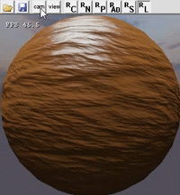
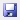

---
---

# Редактор материалов

:::caution Not (yet) implemented feature

Некоторые функции, описанные в настоящем документе, более не поддерживаются, либо начнут поддерживаться в будущем.

:::

**Редактор материалов (SXMaterialEditor)** - один из инструментов движка SkyXEngine, используется для настройки материалов.

Редактор материалов отключает некоторые элементы движка и использует свою собственную симуляционную модель, которая может имитировать все рендерные сущности имеющие материалы.

Эта статья во многом соответствует [основным понятиям материалов](mtl-basics.md). 

|  |
|-|
| Редактор материалов |

## Управление камерой

* CTRL + w – движение вперед;
* CTRL + s – движение назад;
* CTRL + a – движение влево;
* CTRL + d – движение вправо;
* SHIFT - ускорение;
* CTRL + ПКМ – движение вверх/вниз;
* CTRL + ЛКМ – вращение.

## Структура окна

Окно редактора состоит из структурных элементов (сверху вниз):

* Заголовок окна, содержащий имя редактора и имя материала;
* Меню программы;
* Панель инструментов, где расположены основные управляющие кнопки;
* Содержимое окна – рабочая область по настройке материала.

### Меню

* File:
	* Open – открыть материал;
	* Save – сохранить материал;
	* Exit – выход из программы;
* Final image (выводимое изображение в окно рендера):
	* Color – цвет;
	* Normals – нормали;
	* Parameters – параметры освещения;
	* Ambient diffuse - фоновое и диффузное освещение;
	* Specular – отраженный свет;
	* Lighting scene – освещенная сцена.

Для просмотра некоторых итоговых изображений необходимо иметь представление о хранимых данных в [G-buffer](g-buffer.md). 

### Панель инструментов

|  |
|-|
| Общий вид панели инструментов |

Панель инструментов позволяет осуществить более быстрый доступ к функционалу меню.

Панель визуально разделена на 3 части:

* Открыть/сохранить материал;
* Управление видом;
	* cam - возможность управлять камерой;
	* view - стартовое положение камеры;
* Рендер итогового изображения;
	* C - цвет;
	* N - нормали;
	* P - параметры освещения;
	* AD - фоновое и диффузное освещение;
	* S - отраженный свет;
	* L - освещенная сцена.
	
Для просмотра некоторых итоговых изображений необходимо иметь представление о хранимых данных в [G-buffer](g-buffer.md). 

Поиск материала происходит по текстуре, поэтому можно заранее просмотреть в проводнике саму текстуру для которой настраивается материал. 

|  |  |
|-|-|
| Рендер итогового изображения | При зажатой кнопке "cam" возможно перемещение камеры, чтобы вернуться в исходную позиию необходимо нажать кнопку "view" |

### Содержимое рабочей области

#### Общее

 - может иметь несколько логик: 
* Кнопка выбора файлов, после нажатия на эту кнопку следует открытие диалога выбора файла;
* Расширенные настройки.

 - поле для ввода цифровой/текстовой информации. 
После ввода при нажатии на клавишу Enter введенные значения будут приняты. 
Также изменения вступят в силу после того как этот элемент потеряет фокус 
(к примеру щелкнув на пустое место/на другой элемент этого же окна).

 - текстовое поле и трэкбар взаимосвязаны, любое изменение одного из элементов повлечет изменение другого

[Текстуры](textures.md) и [шейдеры](shaders.md) должны соответствовать правилам. 

#### Редакторные настройки

**Редакторные настройки** позволяют по разному увидеть настраиваемый материал. 

|  |
|-|
| Общий вид редакторных настроек |

 - вращение модели по оси Y, кнопка 0 установит угол вращения в 0. 

|  |
|-|
| Если отметить поле "rotate", то модель будет вращаться, для остановки надо убрать отметку, для возвращения в исходный поворот надо нажать кнопку "0") |

 - загрузка кубической текстуры скайбокса.
 
 - тестовые модели: 
* sphere;
* cube;
* plane.

 - настройка цвета света (глобального), в пределах [0, 1]. Сделано для тестов материалов. Внизу имеется полоска окрашенная в выбранный цвет. 

#### Базовые настройки

|  |
|-|
| Общий вид базовых настроек |

**Type model** - выбор типа модели, от выбора зависит рендер и передаваемые данные (принимаемые шейдером), доступно:
* geometry – статическая геометрия;
* grass - трава;
* tree - дерево;
* skin – анимационная модель.

**Tex** - основная (albedo) текстура материала.

**Lighting** - нужно ли освещать материал. Материал может быть самоосвещаемым.

**Alpha Test** - использовать ли альфа тест (отсечение пикселей, которые не прошли минимальный порог прозрачности).

**Transparent** - является ли материал полупрозрачным.

**DestColor** - принимает ли материал свет от какого-либо объекта (для связей с игровыми объектами).

**Reflection** - тип отражения:

* none – нет отражения;
* reflect plane – плоское отражение;
* reflect cube dynamic – динамическое объемное/кубическое отражение;
* reflect cube static - статическое объемное/кубическое отражение, обновляется только в случае изменения данных самого отражения.

**Рекомендуется использовать отражения только в случае крайней необходимости, так как они расходуют достаточно много вычислительных ресурсов в real-time.**

**Shaders** - набор комбинаций шейдеров (пресеты) для упрощения выбора шейдеров, если активна нулевая строка (пустая) значит, выбрана комбинация которой нет в списке.

**VS** - вершинный шейдер.

**PS** - пиксельный шейдер. 

#### Физические настройки

**Физические параметры** - характеристика объекта в соответствии с которыми будем осуществляться некоторое базовое взаимодействие с другими объектами. 

|  |
|-|
| Общий вид физических настроек |

**Physic material** - физический материал:
* concrete (бетон);
* metal (металл);
* glass (стекло);
* plastic (пластик);
* tree (дерево);
* flesh (плоть);
* ground/sand (земля/песок);
* water (вода);
* leaf/grass (листва/трава).

**Hit chance** - шанс пробиваемости [0 - пуля летит насквозь, 1 - пуля ударяется].

**Durability** - коэффициент пробиваемости [0, ], чем больше тем сложнее пробить.

**Density** - плотность материала кг/м3. 

#### Параметры освещения

**Параметры освещения** - характеристики поверхности, по которым будут происходит расчеты ее освещения. 

|  |
|-|
| Общий вид настроек освещения |

**Parameters lighting** - набор параметров освещения (пресеты) для упрощения настройки освещения, если активна нулевая строка (пустая) значит выбранных параметров нет в списке.

**Thickness** - просвечиваемость (для листвы и травы надо делать меньше 1) [0,1]. 

|  |
|-|
| Демонстрация работы параметра "просвечиваемость" |

**Roughness** - шероховатость поверхности, от этого зависит рассеиваемость света по поверхности, чем больше тем больше будет рассеивание света [0,1].

**f0** - отражательная способность поверхности, чем больше тем меньше будет поглощено света и тем больше будет его отражение [0,1] 

|  |
|-|
| Демонстрация работы параметров освещения (изменение шероховатости и отражательной способности) |

 - текстура с параметрами освещения, где можно настроить для каждого пикселя, каналы: 
* red – roughness;
* green - f0;
* blue – thickness;
* alpha - occlusion (можно сгенерировать в Grazy Bump).

Если стоит галочка на texture то будет использована загруженная текстура с параметрами освещения, 
если текстура не загружена будут использоваться нулевые параметры. Если галочка не стоит – будут 
использоваться параметры из редактора (из соответствующих трэкбаров), этот же метод настройки 
поверхности можно использовать в конечном продукте (например в игре), однако, тогда эти параметры 
будут распространяться на всю настраиваемую поверхность. 

#### Параметры детальности

Перечисленные ниже параметры являются обобщенными, и каждый шейдер может использовать их в ином понимании. Поэтому информаци предоставляемая шейдером является более приоритетной.

**Параметры детальности** - характеристики поверхности, при помощи которых основная текстура материала может приобретать детальные элементы. 

|  |
|-|
| Общий вид настроек детальности |

* **Mask** - текстура маски (условно);
* **M R** - текстура микрорельефа (основная либо первая), при использовании шейдером наложения по маске - коэффициент яркости данной текстуры в red канале маски;
* **M G** - текстура микрорельефа (вторая), при использовании шейдером наложения по маске - коэффициент яркости данной текстуры в green канале маски;
* **M B** - текстура микрорельефа (третья), при использовании шейдером наложения по маске - коэффициент яркости данной текстуры в blue канале маски;
* **M A** - текстура микрорельефа (четвертая), при использовании шейдером наложения по маске - коэффициент яркости данной текстуры в alpha канале маски;
* **D R** - детальная текстура (первая), при использовании шейдером наложения по маске - коэффициент яркости данной текстуры в red канале маски;
* **D G** - детальная текстура (вторая), при использовании шейдером наложения по маске - коэффициент яркости данной текстуры в green канале маски;
* **D B** - детальная текстура (третья), при использовании шейдером наложения по маске - коэффициент яркости данной текстуры в blue канале маски;
* **D A** - детальная текстура (четвертая), при использовании шейдером наложения по маске - коэффициент яркости данной текстуры в alpha канале маски.

#### Данные для шейдеров

Каждый шейдер для правильной обработки материалов требует определенные данные. Текущая релаизация позволяет отправлять необходимые движковые данные, и пользовательские. 

#### Движковые данные

**Движковые данные** - те данные которыми владеет движок в любой момент времени. Эти данные в базовых случаях являются необходимыми для рендера.

Галочки vs и ps отвечают за отправку элемента в вершинный и пиксельный шейдеры соответственно. 

|  |
|-|
| Общий вид движковых данных отправляемых в шейдер |

**mW** - матрица мира.

**mV** - матрица вида.

**mP** - матрица проекции.

**mWV** - комбинированная матрица мира вида.

**mWVP** - комбинированная матрица мира вида и проекции.

**CamPos** - позиция камеры.

**Time** - float2 вектор, x – общее время рендера в миллисекундах, y – текущее время рендера кадра в миллисекундах.

**WinSize** - float2 вектор размеров окна рендера в пикселях, x – ширина, y - высота.

#### Пользовательские данные

Пользовательские данные представлены только в виде float4 векторов по одному для каждого вида шейдера (один для вершинного и один для пиксельного). Однако, оба вектора можно отправить в один шейдер, либо отправить по назначению и в другой шейдер. Например, пользовательский вектор для пиксельного шейдера можно отправить и в пиксельный и в вершинный, с теми же данными.

Компоненты векторов пользовательских данных должны быть в пределах [-1,1]. 

|  |
|-|
| Общий вид пользовательских данных отправляемых в шейдер |

 - отправка пользовательских данных в вершинный шейдер. 

 - отправить пользовательские данные вершинного шейдера в пиксельный. 

 - отправка пользовательских данных в пиксельный шейдер. 

 - отправить пользовательские данные пиксельного шейдера в вершинный. 

|  |
|-|
| Пример работы пользовательского вектора: влияние z компоненты вектора на проявление микрорельефа |

## Загрузка/Сохранение

Для загрузки материала необходимо нажать кнопку  на [панели инструментов](#панель-инструментов), либо выбрать Open в [Меню](#меню) File. 
После этого откроется диалоговое окно выбора файла текстуры, для которой будет настраиваться материал. В диалоге необходимо выбрать текстуру и нажать Select.

Для загрузки материала надо нажать кнопку  на [панели инструментов](#панель-инструментов), либо выбрать Save в [Меню](#меню) File. 
После этого, материал будет автоматически сохранен в директорию gamesource/materials/ аналогично структуре [директории текстур](textures.md), диалога выбора файла не будет. 

