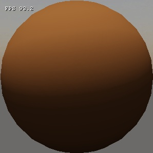

---
---

# Стандартные шейдеры материалов

В статье представлено описание шейдеров материалов стандартной поставки (из общественного репозитория).

Данная статья во многом опирается на понятия [редактора материалов](mtl-editor.md) и [основные понятия состава материалов](mtl-basics.md). 

## Default

Описание: базовый шейдер для большинства типов материалов.

|  |
|-|
| Default |

### Общие настройки

**Флаги**

| Ключ                  | Название          | Описание
|-----------------------|-------------------|---------
| has_parameter_texture | Use param texture | Включает использование текстуры параметров, если установлен, используется текстура **txParameters**, в противном случае используются отдельные константы
| has_alphatest         | Enable alphatest  | Включает использование альфатеста. Порог альфатеста задается в константе **pbr_alphatest_threshold**
| emissive              | Emissive          | Включает светимость материала. Становится доступна опциональная текстура **txEmissive** и коэффициент светимости **em_multiplier**

**Текстуры**

| Ключ         | Название      | Требуется? | Описание |
|--------------|---------------|------------|----------|
| txBase       | Base texture  | Да         | Основная текстура материала |
| txNormals    | Normal map    | Нет        | Карта нормалей. Вес задается в константе nm_weight |
| txParameters | Param texture | Если установлен флаг **has_parameter_texture** | Карта параметров PBR. Каналы: <pre> \* red – roughness  \* green - metallic  \* blue – thickness  \* alpha - occlusion (можно сгенерировать в Grazy Bump)</pre> |
| txEmissive   | Emissive map  | Если установлен флаг **emissive** | Карта светимости. rgb -- цвет, a -- яркость. Коэффициент яркости задается в константе **em_multiplier**. Если не задана -- используется **txBase** |

**Константы**

| Ключ          | Название            | Тип   | Значение по умолчанию | Описание
|---------------|---------------------|-------|-----------------------|---------
| nm_weight     | Normalmap weight    | float | 1.0                   | Вес карты нормалей
| em_multiplier | Emissive multiplier | float | 2.0                   | Коэффициент яркости карты светимости, значения [0.0 - 1000.0]
| pbr_roughness | Roughness           | float | 0.5                   | Шероховатость, значения [0.0 - 1.0]
| pbr_metallic  | Metallic            | float | 0.0                   | Металличность, значения [0.0 - 1.0]
| pbr_thickness | Thickness           | float | 1.0                   | Просвечиваемость, значения [0.0 - 1.0]. 1.0 -- полностью непросвечиваемый
| pbr_ao        | AO                  | float | 1.0                   | Ambient occlusion, значения [0.0 - 1.0] 

### Настройки для прохода xGBuffer

**Флаги**

| Ключ           | Название       | Описание
|----------------|----------------|---------
| has_f0_texture | Use f0 texture | Включает использование текстуры f0, если установлен, используется текстура txF0, в противном случае используются отдельные константы

**Текстуры**

| Ключ | Название   | Требуется?                              | Описание
|------|------------|-----------------------------------------|-------------
| txF0 | f0 texture | Если установлен флаг **has_f0_texture** |  Текстура f0

**Константы**

| Ключ   | Название | Тип   | Значение по умолчанию | Описание
|--------|----------|-------|-----------------------|-------------------------
| pbr_f0 | f0       | float | 0.04                  | F0, значения [0.0 - 1.0]

## Transparent

**Описание**: базовый шейдер для прозрачных материалов. 

### Общие настройки

**Флаги**

| Ключ                  | Название          | Описание
|-----------------------|-------------------|---------
| has_parameter_texture | Use param texture | Включает использование текстуры параметров, если установлен, используется текстура **txParameters**, в противном случае используются отдельные константы
| refractive            | Refraction        | Включает рефракцию материала. Карта рефракции задается в текстуре **txNormals**. Мощность рефракции задается в константе **nm_weight**

**Текстуры**

| Ключ         | Название      | Требуется? | Описание |
|--------------|---------------|------------|----------|
| txBase       | Base texture  | Да         | Основная текстура материала |
| txNormals    | Normal map    | Нет        | Карта нормалей. Вес задается в константе nm_weight |
| txParameters | Param texture | Если установлен флаг **has_parameter_texture** | Карта параметров PBR. Каналы: <pre> \* red – roughness  \* green - metallic  \* blue – thickness  \* alpha - occlusion (можно сгенерировать в Grazy Bump)</pre> |

**Константы**

| Ключ          | Название            | Тип   | Значение по умолчанию | Описание
|---------------|---------------------|-------|-----------------------|---------
| nm_weight     | Normalmap weight    | float | 1.0                   | Вес карты нормалей
| pbr_roughness | Roughness           | float | 0.5                   | Шероховатость, значения [0.0 - 1.0]
| pbr_metallic  | Metallic            | float | 0.0                   | Металличность, значения [0.0 - 1.0]
| pbr_thickness | Thickness           | float | 1.0                   | Просвечиваемость, значения [0.0 - 1.0]. 1.0 -- полностью непросвечиваемый
| pbr_ao        | AO                  | float | 1.0                   | Ambient occlusion, значения [0.0 - 1.0] 

## Sky

**Описание**: базовый шейдер для скайбокса. 

### Общие настройки

**Текстуры**

| Ключ         | Название      | Требуется? | Описание
|--------------|---------------|------------|---------
| txBase       | Base texture  | Да         | Основная текстура материала, тип -- кубическая
