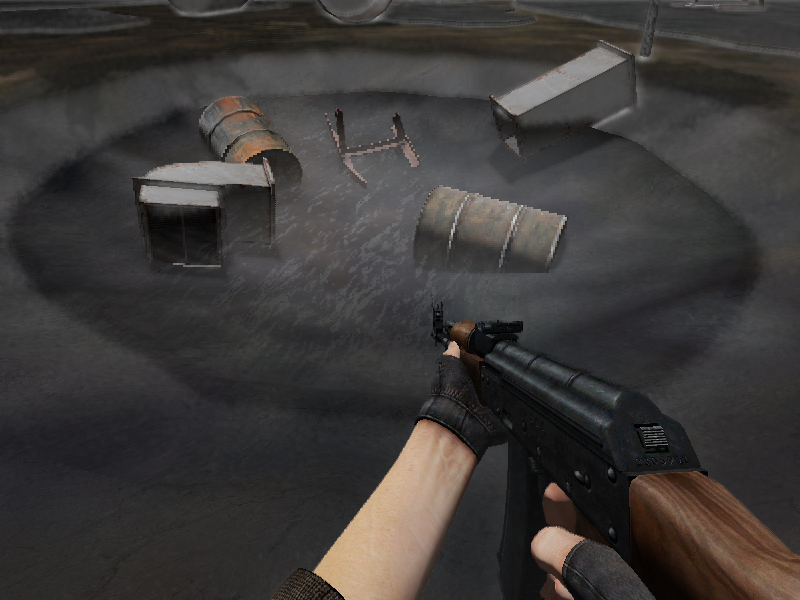

---
---

# Прозрачность

:::caution Not (yet) implemented feature

Некоторые функции, описанные в настоящем документе, более не поддерживаются, либо начнут поддерживаться в будущем.

:::

**Прозрачность** - свойство материала пропускать свет, в контексте 3d графики проявляется в виде невидимого материала за которым видна сцена.

**Полупрозрачные материалы** (полупрозрачные поверхности - ППП) имеют диапазон прозрачности в пределах [0.5, 1]. 

## Реализация

Так как SkyXEngine использует технику отложенного освещения (deferred shading) то для реализации прозрачности были использованы некоторые трюки:
- Вместо прозрачных поверхностей используются полупрозрачные (непрозрачность в пределах [0.5, 1], в байтах [127, 255]), значения непрозрачности ниже 8, отсекаются альфа тестом (дефайн `MTL_ALPHATEST_FORCEBLY_VALUE`);
- Рендер ППП осуществляется только в статической геометрии и только после рендера непрозрачных поверхностей;
- Расчет освещения происходит в одном проходе как для непрозрачных поверхностей так и для ППП.

|  |
|-|
| Итоговое изображение смешивания непрозрачных и полупрозрачного слоев сопровождается альясингом |

|  |
|-|
| Итоговое изображение смешивания трех пересекающихся полупрозрачных поверхностей и непрозрачного материала |

Библиотека статической геометрии при загрузке моделей вычленяет из них все полупрозрачные подгруппы, разделяя сами подгруппы на самостоятельные модели. Поэтому возможна сортировка полупрозрачных моделей.

ППП рисуются в тот же G-buffer, в который рисуются непрозрачные поверхности, но с некоторыми ухищрениями (по другому не назвать):
- stencil буфер метиться значениями что позволяет объединить 4 пикселя в один, зарезервировав верхний левый под непрозрачные поверхности, а остальные под ППП, то есть итоговый G-buffer расслаивается на 4 слоя.

|  |
|-|
| На данном скриншоте видно, что через строчку и через столбик в текстуру записан цвет воды |

|  |
|-|
| Цветовой буфер с тремя пересекающимися полупрозрачными поверхностями |

Таким образом, освещение всех поверхностей осуществляется за один проход освещения, после которого следует объединение всех слоев на основании информации о поверхностях.

Этот метод:
- Позволяет быстро и менее затратно реализовать до 3 перекрывающихся ППП (чего вполне хватает для средней сцены);
- Создает альясинг в местах где есть ППП так как итоговый пиксель состоит из 4 пикселей, для борьбы с этим явление возможно использовать только SSAA если позволяют вычислительные возможности.

## Использование

Для того чтобы материал был полупрозрачным необходимо:
- Чтобы материал создавался для статической геометрии (только статика поддерживает ППП);
- Текстура с альфа-каналом со значениями меньше 255;
- В параметрах материала указать [свойство полупрозрачности](mtl-basics.md#параметры-освещения).

Никаких иных действий для отделения полупрозрачных моделей от непрозрачных совершать не надо.

## Рекомендации

- Использовать только ППП, где текстура имеет значение непрозрачности от [0.5, 1];
- По максимуму использовать полупрозрачные пиксели в текстуре, оставляя минимум непрозрачных, в лучшем случае вообще без них;
- Не использовать случаев когда более трех полупрозрачных поверхностей могут быть перекрыты друг другом, в этом случае нет никаких гарантий правильного рендера, но такие случаи редки;
- По минимуму использовать пересекающиеся ППП.
