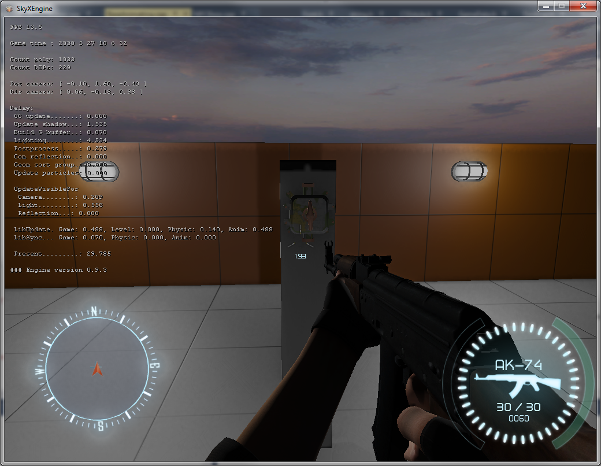
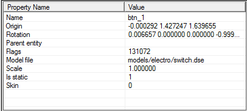
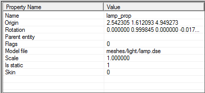
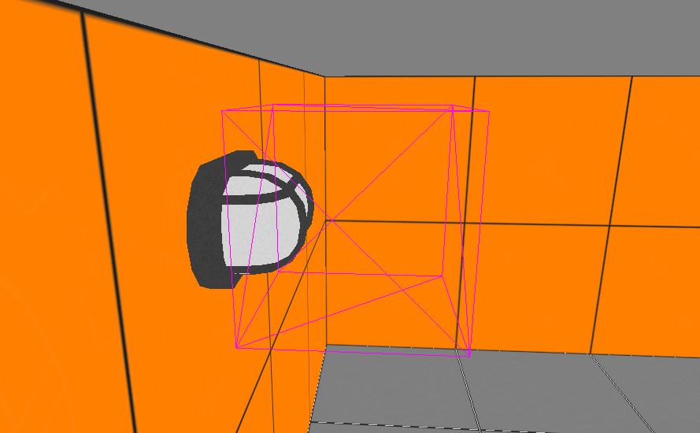
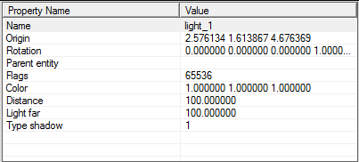
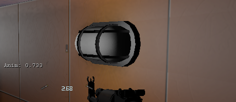
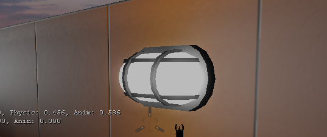

---
---

# Управление светом кнопкой

:::caution Not (yet) implemented feature

Некоторые функции, описанные в настоящем документе, более не поддерживаются, либо начнут поддерживаться в будущем.

:::

## Введение

В этом туториале рассказывается о том, как создать анимированную кнопку, управляющую двумя лампочками. 

## Создание кнопки

В редакторе уровней создаем entity `prop_button`. Задаем произвольное имя, например `btn_1`. В свойство `Model file` устанавливаем подходящую модель кнопки, 
например `models/electro/switch.dse` и устанавливаем флаг `Toggleable`, для того, чтобы кнопка работала в режиме переключателя. Таблица свойств будет выглядеть примерно так: 

## Создание лампочек

Каждая лампочка состоит из двух частей: непосредственно источник света, и модель светильника. Повторяем процедуру для необходимого количества лампочек.

### Модель светильника

В редакторе уровней создаем entity `prop_dynamic`. Устанавливаем подходящую модель, например `meshes/light/lamp.dse`, 
задаем произвольное имя, например `lamp_prop` и перемещаем в подходящее место. Таблица свойств будет выглядеть примерно так: 

### Источник света

Создаем entity `light_point` и размещаем его непосредственно перед визуальной моделью светильника. 

Задаем имя `light_1` и устанавливаем цвет и яркость по желанию. Устанавливаем флаг `Initially dark` - так наша лампочка будет выключена после загрузки уровня. Таблица свойств будет выглядеть примерно так: 

## Настройка соединений

Теперь необходимо подсоединить кнопку к лампочкам, чтобы она могла ими управлять. В списке объектов выделяем кнопку, и переходим в режим редактирования соединений. 

### Анимация кнопки

В первую очередь - надо подключить анимацию кнопки. Создаем новое соединение: 

| Event     | On push down
|-----------|-------------
| Name      | btn_1
| Action    | Play anim
| Delay     | 0
| Parameter | turn_on 

При вжатии кнопки, запускаем на ней же анимацию с именем `turn_on`.

И еще одно соединение: 

| Event     | On push up
|-----------|-----------
| Name      | btn_1
| Action    | Play anim
| Delay     | 0
| Parameter | turn_off 

При отжатии кнопки, запускаем на ней же анимацию с именем `turn_off`.

Помните, мы устанавливали флаг `Toggleable`? Он позволяет нашей кнопке иметь два состояния: вжатое и отжатое. 

### Управление светом

Теперь подключим кнопку к источникам света `light_point`. На включение: 

| Event     | On push down
|-----------|-------------
| Name      | light_1
| Action    | Turn on
| Delay     | 0.2
| Parameter | 

Лампочка включается через 0.2 секунды после активации кнопки, это нужно, чтобы анимация поворота переключается успела проиграться до нужного момента.

И на выключение: 

| Event     | On push up
|-----------|-----------
| Name      | light_1
| Action    | Turn off
| Delay     | 0
| Parameter | 

На самом деле, в данный момент наша кнопка уже прекрасно работает, но если мы включим свет - заметим неприятный эффект: 

Модель лампочки темная. Для решения этой проблемы у нашей модели есть два скина: отключенный и включенный. В последнем случае материал плафона имеет свойство самосветимости. Нам надо только переключать скин вместе со включением света. 

### Переключение скина лампочки

Создаем два соединения: 

| Event     | On push down
|-----------|-------------
| Name      | lamp_prop
| Action    | Set skin
| Delay     | 0.2
| Parameter | 1

| Event     | On push up
|-----------|-----------
| Name      | lamp_prop
| Action    | Set skin
| Delay     | 0
| Parameter | 0 

Теперь лампочка светится как подобает: 

## Загрузки

Пример уровня из туториала можно скачать здесь: [tutor_01.zip](https://ds-servers.com/files/677/tutor_01.zip).
